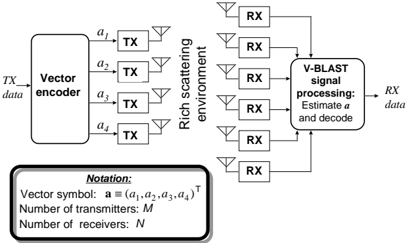
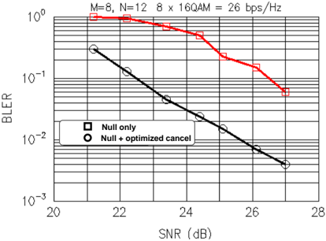
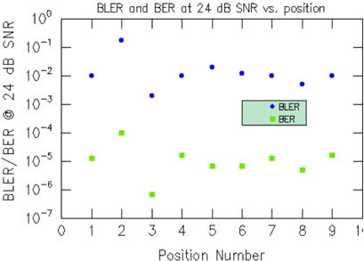

## V-BLAST: An Architecture for Realizing Very High Data Rates Over the Rich-Scattering Wireless Channel

P. W. Wolniansky, G. J. Foschini, G. D. Golden, R. A. Valenzuela Bell Laboratories, Lucent Technologies, Crawford Hill Laboratory 791 Holmdel-Keyport Rd., Holmdel, NJ 07733

## ABSTRACT

Recent information theory research has shown that the rich-scattering wireless channel is capable of enormous  theoretical  capacities  if  the  multipath  is properly  exploited. In this  paper,  we  describe  a wireless communication architecture known as vertical  BLAST  (Bell  Laboratories  Layered  SpaceTime)  or  V-BLAST,  which  has  been  implemented  in realtime  in  the  laboratory. Using  our  laboratory prototype, we have demonstrated spectral efficiencies of 20 -40 bps/Hz in an indoor propagation environment at realistic SNRs and error rates. To the best of our knowledge, wireless spectral efficiencies of this magnitude are unprecedented, and are furthermore unattainable using traditional techniques.

## 1. INTRODUCTION

In  the  past  few  years,  theoretical  investigations  have revealed that the multipath wireless channel is capable of  enormous  capacities,  provided  that  the  multipath scattering is sufficiently rich and is properly exploited through the use of an appropriate processing architecture [1-4].  The diagonally-layered space-time architecture proposed by Foschini [1], now known as diagonal  BLAST  (Bell  Laboratories  Layered  SpaceTime) or D-BLAST, is one such approach.  D-BLAST utilizes multi-element antenna arrays at both transmitter  and  receiver  and  an  elegant  diagonallylayered  coding  structure  in  which  code  blocks  are dispersed across diagonals in space-time. In an independent Rayleigh scattering environment, this processing  structure  leads  to  theoretical  rates  which grow linearly with the number of antennas (assuming equal numbers of transmit and receive antennas) with these rates approaching 90% of Shannon capacity.

However, the diagonal approach suffers from certain  implementation  complexities  which  make  it inappropriate for initial implementation.  In this paper, we describe a simplified version of BLAST known as vertical BLAST  or V-BLAST, which has been implemented in realtime in the laboratory. Using our laboratory  prototype,  we  have  demonstrated  spectral efficiencies  of  20  -  40  bps/Hz  at  average  SNRs ranging from 24 to 34 dB. Although these results were obtained  in  a  relatively  benign  indoor  environment, we believe that spectral efficiencies of this magnitude are unprecedented, regardless of propagation environment  or  SNR,  and  are  simply  unattainable using traditional techniques.

## 2. SYSTEM OVERVIEW

A  high-level  block  diagram  of  a  BLAST  system  is shown in Fig. 1. A single data stream is demultiplexed into M substreams, and each substream is then encoded into symbols and fed to its respective transmitter. (The  encoding  process  is  discussed  in more detail below.)  Transmitters 1 -M operate cochannel at symbol rate 1 /  T symbols/sec, with synchronized symbol timing. Each transmitter is itself an ordinary  QAM  transmitter. The  collection of transmitters comprises, in effect, a vector-valued transmitter,  where  components  of  each  transmitted M -vector are symbols drawn from a QAM constellation.  We assume that the same constellation is used for each substream, and that transmissions are organized into bursts of L symbols. The  power launched by each transmitter is proportional to 1 /  M so that the total radiated power is constant and independent of M .

Figure 1: V-BLAST high level system diagram

The essential difference between D-BLAST and VBLAST  lies  in  the  vector  encoding  process.  In  DBLAST, redundancy between the substreams is introduced through the use of specialized intersubstream block coding.  The D-BLAST code blocks are organized along diagonals in space-time.  It is this coding that leads to D-BLAST's  higher  spectral efficiencies  for  a  given  number  of  transmitters  and receivers.  In V-BLAST, however, the vector encoding process is simply a demultiplex operation followed by independent bit-to-symbol mapping of each substream. No  inter-substream  coding,  or  coding  of any kind,  is  required,  though  conventional  coding  of the  individual  substreams  may  certainly  be  applied. For  the  remainder  of  this  paper,  we  will  assume  for simplicity that the substreams comprise  uncoded, independent data symbols.

Receivers  1 -N are, individually,  conventional QAM  receivers. These  receivers  also  operate  cochannel, each receiving the signals radiated from all M transmit  antennas. For  simplicity  in  the  sequel,  flat fading  is  assumed,  and  the  matrix  channel  transfer function is H N × M , where h i  j is the (complex) transfer function  from  transmitter j to  receiver i ,  and M ≤ N . We  take the quasi-stationary viewpoint that the channel time variation is negligible over the L symbol periods  comprising  a  burst,  and  that  the  channel  is estimated accurately, e.g. by use of a training sequence embedded in each burst; thus, for brevity in the  remainder  of  the  paper,  we  will  not  make  the distinction between H and its estimate.

Although V-BLAST, as shown above, is essentially a single-user system which uses multiple transmitters, one  can  naturally  ask  in  what  ways  the  BLAST approach differs from simply using traditional multiple access techniques in a single-user fashion, i.e. by driving all the transmitters from a single user's data which has been split  into  substreams.  Some  of  these differences are worth pointing out: First, unlike codedivision or other spread-spectrum  multiple  access techniques,  the  total  channel  bandwidth  utilized  in  a BLAST system is only a small  fraction  in  excess  of the  symbol rate, i.e.  similar to the excess bandwidth required  by  a  conventional  QAM  system.  Second, unlike  FDMA,  each  transmitted  signal  occupies  the entire  system  bandwidth.  Finally,  unlike  TDMA,  the entire system bandwidth is used simultaneously by all of the transmitters all of the time.

Taken together, these differences together are precisely  what  give  BLAST  the  potential  to  realize higher  spectral  efficiencies  than  the  multiple-access techniques. In fact, an essential feature of BLAST is that  no  explicit  orthogonalization  of  the  transmitted signals  is  imposed  by  the  transmit  structure  at  all. Instead,  the  propagation  environment  itself,  which  is assumed to exhibit  significant  multipath,  is  exploited to achieve the signal decorrelation necessary to separate the co-channel signals.  V-BLAST utilizes a combination  of  old  and  new  detection  techniques  to separate the signals in an efficient manner, permitting operation at significant fractions of the  Shannon capacity  and  achieving  large  spectral  efficiencies  in the process.

## 3. V-BLAST DETECTION

In  what  follows,  we  take  a  discrete-time  baseband view of the detection process for a single transmitted vector symbol, assuming symbol-synchronous receiver sampling and ideal timing. Letting a = ( a 1 , a 2 , . . . , a M ) T denote the vector of transmit symbols, then the corresponding received N -vector is where ν is a noise vector with components drawn from IID wide-sense stationary processes with variance σ 2 .

One way to perform detection for this system is by using  conventional  adaptive  antenna  array  (AAA) techniques, i.e. linear combinatorial nulling [6]: Conceptually, each substream in turn is considered to be the desired signal, and the remainder are considered as "interferers". Nulling is performed  by  linearly weighting  the  received  signals  so  as  to  satisfy  some performance-related criterion, such as minimum mean-squared error (MMSE) or zero-forcing (ZF).

For example, zero-forcing nulling can be performed by  choosing  weight  vectors w i , i = 1  , 2  , . . . , M , such that

$$w _ { i } ^ { \top } ( H ) _ { j } \ = \ \delta _ { i j }$$

where  ( H ) j is  the j -th  column  of H ,  and δ is  the Kronecker  delta.  Thus,  the  decision  statistic  for  the i -th substream is y i = w i T r 1 .

This linear nulling approach is viable, but superior performance  is  obtained  if  nonlinear  techniques  are used. One particularly attractive nonlinear alternative is  to  exploit  the  timing  synchronism  inherent  in  the system model (the assumption of co-located transmitters  makes  this  completely  reasonable)  and use symbol  cancellation as  well  as  linear  nulling  to perform detection. Using symbol cancellation, interference from already-detected components of a is subtracted out from the received signal vector, resulting  in  a  modified  received  vector  in  which, effectively, fewer interferers are present. This is somewhat analogous to decision feedback equalization.

When  symbol  cancellation  is  used,  the  order  in which  the  components  of a are  detected  becomes important  to  the  overall  performance  of  the  system. Later,  we  will  show  how  to  determine  a  particular ordering which is optimal in a certain sense; for now, we first  discuss  the  general  detection  procedure  with respect to an arbitrary ordering.

Let the ordered set

$$S \equiv \{ k _ { 1 } , k _ { 2 } , \cdots , k _ { M } \}$$

be a permutation of the integers 1  , 2  , . . . , M specifying  the  order  in  which  components  of  the transmitted symbol vector a are extracted. The detection process proceeds generally as follows:

Step  1 : Using  nulling vector w k 1 ,  form  decision statistic y k 1 :

$$y _ { k _ { 1 } } \ = \ w _ { k _ { 1 } } ^ { \top } r _ { 1 }$$

Step 2 : Slice y k 1 to obtain a ˆ k 1 :

$$\hat { a } _ { k _ { 1 } } \ = \ Q ( y _ { k _ { 1 } } )$$

where Q ( . ) denotes the quantization (slicing) operation appropriate to the constellation in use.

Step 3 : Assuming that a ˆ k 1 = a k 1 , cancel a k 1 from the received  vector r 1 ,  resulting  in  modified  received vector r 2 :

$$r _ { 2 } \ = \ r _ { 1 } \ - \ \hat { a } _ { k _ { 1 } } ( \mathbf H ) _ { k _ { 1 } }$$

where ( H ) k 1 denotes the k 1 -th column of H .  Steps 1 3 are then performed for components k 2 , . . . , k M by operating  in  turn  on  the  progression  of  modified received vectors r 2 , r 3 , . . . , r M .

The specifics of the detection process depend on the criterion  chosen  to  compute  the  nulling  vectors w k i , the  most  common of these being MMSE or ZF. The detection process is described here with respect to the ZF criterion since it is somewhat simpler to state.  The k i -th ZF-nulling vector is defined as the  unique minimum norm vector satisfying

$$w _ { k _ { i } } ^ { \top } ( H ) _ { k _ { j } } \ = \ \begin{cases} 0 & j \geq i \\ 1 & j = i \end{cases} .$$

Thus, w k i is  orthogonal  to  the  subspace  spanned  by the  contributions  to r i due  to  those  symbols  not  yet estimated and cancelled.  It is not difficult to show that the unique vector satisfying (7) is just the k i -th row of H k i -1 \_\_\_ + where  the  notation H k i \_ \_ denotes the  matrix obtained  by  zeroing  columns k 1 , k 2 , . . . , k i of H and + denotes the Moore-Penrose pseudoinverse [5].

The  post-detection  SNR  for  the k i -th detected component of a is  easily  obtained by substituting (1) and (7) into (4), and taking expected values, i.e.

$$\rho _ { k _ { i } } \ = \ \frac { < | a _ { k _ { i } } | ^ { 2 } > } { \sigma ^ { 2 } \left \| w _ { k _ { i } } \right \| ^ { 2 } }$$

where the expectation in the numerator is taken over the constellation set.

## 3.1 OPTIMAL DETECTION ORDERING

As  mentioned  earlier,  when  symbol  cancellation  is used, the system performance is affected by the order in which the components of a are detected, whereas it does not matter when pure nulling is used. In order to appreciate  this,  first  consider  why  it  is  that  nulling with  cancellation  performs  better  than  pure  nulling, regardless of ordering.

When nulling alone is used, each nulling vector is required, according to (2), to be orthogonal to M -1 rows  of H .  However,  when  symbol  cancellation  is employed in addition to nulling, w k i is required to be orthogonal only to the M -i undetected components as  per  (7).  A  simple  consequence  of  the  CauchySchwartz inequality is that the more rows of H that a particular w k i is  constrained  to  be  orthogonal  to,  the larger its norm, and thus, according to (8), the smaller its post-detection SNR.  When using cancellation then, the ρ k i are lower bounded (with equality only for ρ k 1 ) by their corresponding nulling-only ρ k i .

The importance of ordering is simply that it permits, during the detection of the i -th component, a choice as to which subset  of M -i rows  that w k i should  be constrained by; different choices lead to different ρ k i . For example, in an M = 3 system, detecting component 1 first (in the presence of 2 and 3) will, in general,  result  in  a  different ρ 1 than  if  component  2 was detected first (in the presence of 1 and 3).  With pure nulling, each component is always detected in the presence of all the others, so ordering does not matter.

Now recall that all components of a are assumed to utilize the same constellation. Under this assumption, the component with the smallest ρ k i will dominate the error  performance  of  the  system.  Thus,  an  obvious figure  of  merit  for  this  system  -  though  not  the  only one  possible  -  is  the  maximization  of  the  worst,  i.e. the  minimum,  of  the ρ k i over  all  possible  detection orderings. A  surprising  result  -  and  one  which  we believe  has  not  been  previously  appreciated  -  is  that simply  choosing  the  best ρ k i at  each  stage  in  the detection process leads to the globally  optimum ordering, S opt ,  in  this  maximin  sense. The  proof  is given in the appendix.

We  remark  that  this  optimality  result  may  have wider  applicability  to  multi-user  cancellation-based detection as well. Although the "best first" cancellation  approach  is  widely  known  within  the multi-user community  [7-8],  essentially being the defacto  approach,  we  are  not  aware  of  any  previous proof of its optimality in the sense given here.

The full ZF V-BLAST detection algorithm can now be  described  compactly  as  a  recursive  procedure, including  determination  of  the  optimal  ordering,  as follows:

initialization:

$$G _ { 1 } \ = \ H ^ { ^ { + } } \Big ( \begin{matrix} 9 b \\ 9 b \end{matrix} \Big )$$

$$\begin{matrix} i & \leftarrow & 1 \\ G _ { 1 } & \bar { = } & H ^ { ^ { + } } \end{matrix}$$

$$k _ { 1 } \ = \ \arg \min _ { j } \left \| ( G _ { 1 } ) _ { j } \right \| ^ { 2 } \quad \ \quad ( 9 c )$$

recursion:

$$w _ { k _ { i } } \ = \ ( G _ { i } ) _ { k _ { i } }$$

$$y _ { k _ { i } } \ = \ w _ { k _ { i } } ^ { T } r _ { i }$$

$$\hat { a } _ { k _ { i } } \ = \ Q ( y _ { k _ { i } } )$$

$$r _ { i + 1 } \ = \ r _ { i } \ - \ \hat { a } _ { k _ { i } } ( \mathbf H ) _ { k _ { i } } \quad ( 9 g )$$

$$G _ { i + 1 } \ = \ H _ { k _ { i } } ^ { \frac { + } { - } }$$

$$k _ { i + 1 } \ = \ \underset { j \notin \{ k _ { i } \ \cdots \ k _ { j } \} } { \arg \min } \| ( G _ { i + 1 } ) _ { j } \| ^ { 2 } \quad ( 9 i )$$

$$i \, \leftarrow \, i \, + \, 1$$

where  ( G i ) j is  the j -th  row  of G i . Thus,  (9c,i) determine the elements of S opt ,  the  optimal  ordering; (9d-f) compute respectively the ZF-nulling vector, the decision  statistic,  and  the  estimated  component  of a ; (9g) performs cancellation of the detected component from the received vector, and (9h) computes the new pseudoinverse  for  the  next  iteration. Note  that  this new pseudoinverse is based on a "deflated" version of H ,  in  which  columns k 1 , k 2 , . . . , k i have  been zeroed.  This  is  because  these  columns  correspond  to components of a which  have  already  been  estimated and cancelled, and thus the system becomes equivalent to a "deflated" version of Fig. 1 in which transmitters k 1 , k 2 , . . . , k i have been removed, or equivalently, a system in which a k 1 = . . . = a k i = 0.

## 4. LABORATORY RESULTS

A  laboratory  prototype  of  a  V-BLAST  system  has been constructed for the purpose of demonstrating the feasibility  of  the  BLAST  approach.  The  prototype operates  at  a  carrier  frequency  of  1.9  GHz,  and  a symbol rate of 24.3 ksymbols/sec, in a bandwidth of 30  kHz. The  receiver  processing  is  similar  to  that shown in (9).

The  system  was  operated  and  characterized  in  the actual laboratory/office environment, not a test range, with transmitter  and  receiver  separations  up  to  about 12  meters.  This  environment  is  relatively  benign  in that the delay spread is negligible, the fading rates are low, and there is significant near-field scattering from nearby equipment and office furniture. Nevertheless, it is  a  representative  indoor  lab/office  situation,  and  no attempt was made to "tune" the system to the environment,  or  to  modify  the  environment  in  any way.

The  antenna  arrays  consisted  of λ / 2  wire  dipoles mounted  in  various  arrangements.  For  the  results shown below, the receive dipoles were mounted on the surface of a metallic hemisphere approximately 20 cm in diameter, and the transmit dipoles were mounted on a flat metal sheet, in a roughly rectangular array with about λ / 2 inter-element spacing. In general, the system performance was found to be nearly independent of small details of the array geometry.

Fig. 2  shows  results  obtained  with  the  prototype system, using M = 8 transmitters and N = 12 receivers. In this experiment, the transmit and receive arrays  were  each  placed  at  a  single  representative position within the environment, and the performance characterized. The horizontal axis is spatially averaged received SNR, i.e., N 1 \_  \_ i = 1 Σ N SNRi , where SNRi

is  the  the  ratio  of  received  signal  power  (from  all M transmitters)  to  noise  power  at  the i -th  receiver.  The vertical axis is the block error rate, where a "block" is defined as a single transmission burst. In this case, the burst  length L is  100  symbol  durations,  20  of  which are  used  for  training.  In  this  experiment,  each  of  the eight  substreams  utilized  uncoded  16-QAM,  i.e.  4 bits/symbol/transmitter, so that the payload block size is  8 × 4 × 80 = 2560 bits.  The raw spectral efficiency of this configuration is thus

$$E_{s} = \frac{(8 \times m_r)\times(4\,\text{b/sym}/x\,m_r)\times(24.3\,\text{ksym/s})}{30\,\text{kHz}}$$

and  the  payload  efficiency  is  80%  of  the  above,  or 20.7  bps/Hz,  corresponding to a payload data rate of 621 kbps in 30 kHz bandwidth.

Figure 2: Single-position performance

The upper curve in Fig. 2  shows  performance obtained when conventional nulling is used. The lower curve shows performance using nulling and optimally-ordered cancellation. The average difference is  about  4  dB,  which  corresponds  to  a  raw  spectral efficiency differential (for this configuration) of around 10 bps/Hz.

1

Figure 3: Multiple-position performance

Figure 3 shows performance results obtained using the same BLAST  system configuration ( M = 8, N = 12,  16-QAM)  when  the  receive  array  was  left fixed  and  the  transmit  array  was  located  at  different positions  throughout  the  environment.  In  each  case, the  transmit  power  was  adjusted  so  that  the  average received SNR was 24 ± 0.5 dB. Nulling with optimized cancellation was used.

It can be seen that operation at this spectral efficiency is reasonably robust with respect to antenna position.  In  all  positions,  the  system  had  at  least  2 orders  of  magnitude  margin  relative  to  10 -2 BER. For  a  completely  uncoded  system,  these  are  entirely reasonable  error  rates,  and  application  of  ordinary error correcting codes would significantly reduce this. At  34  dB  SNR,  spectral  efficiencies  as  high  as  40 bps/Hz have been demonstrated at similar error rates, though with less robust performance.

We believe these spectral efficiencies to be unprecedented for the wireless channel. It is worthwhile  to  point  out  that  spectral  efficiencies  of these magnitudes are essentially impossible to obtain using traditional approaches in which a single transmitter is used, simply because the required constellation loadings would be immense. For example,  to  obtain  the  equivalent  of  the  32  bits  per vector  symbol  in  the  experiments  above,  but  using  a single  transmitter,  would  require  a  constellation  with 2 32 or more than a billion (10 9 )  points, which seems well outside of the realm of practicality, regardless of SNR.

## SUMMARY AND CONCLUSIONS

We have described V-BLAST, a wireless architecture capable of realizing extraordinary spectral efficiencies over the rich-scattering wireless channel. The general BLAST approach and the V-BLAST detection scheme were motivated and described in detail, and an interesting new optimality result regarding cancellation-based  detection  (which  may  have  wider applicability to multi-user detection  as  well)  was reported. Early  results  with  our  V-BLAST  realtime laboratory prototype have proven the feasibility of the concept, and we have demonstrated spectral efficiencies of 20 - 40 bps/Hz under real-world indoor conditions, exceeding any results that we are aware of using traditional modulation techniques.  Although these  results  were  obtained  in  a  relatively  benign environment, we are nevertheless strongly encouraged,  and  believe  that  the  BLAST  approach may eventually lead to significantly improved spectral efficiencies in wireless systems.

## APPENDIX: PROOF OF THE OPTIMALITY OF ORDERING IMPOSED BY EQ. (9)

## Definitions and notation:

For a given detection ordering S ≡ { S 1 , S 2 , . . . , S M }  define  the constraint  set of S i to  be  the  set  { S i + 1 , S i + 2 , . . . , S M },  or  the  null set if i = M . The constraint set is just those components of a which have not yet been detected and cancelled.

Let S be a detection ordering. Then define ρ Si to be the post-detection SNR  at the i -th stage of the detection process when using this ordering, i.e. ρ Si is the post-detection SNR when detecting a S i according to (9e).

Let L ≡ { L 1 , L 2 , . . . , LM } be the locallyoptimum ordering obtained using (9).

The  following  trivial  lemmas  are  used  in  what follows and are stated here without proof:

Lemma 1 : Let A and B be two distinct orderings.  If Ak = Bk ,  and  the  constraint  sets  of Ak and Bk consist  of  identical  elements  (regardless  of  their order), then ρ Ak =  ρ Bk .

Lemma 2 : Let A and B be two distinct orderings.  If Ak = Bk , and the constraint set of Ak is a subset of the constraint set of Bk , then ρ Ak ≥  ρ Bk .

## Proof:

Let Q ≡ { Q 1 , Q 2 , . . . , QM } be an arbitrary ordering distinct from L .  Let d be the index of the first (leftmost) element for which L and Q differ. Let r be the index for which Qr = Ld . (Note that r &gt; d , since L and Q have  common  elements  up  to  index d -1.) By Lemma 1,

$$\rho _ { L _ { i } } \ = \ \rho _ { Q _ { i } } \quad \ 1 \leq i \leq d - 1 \ . \quad ( A . 1 )$$

Now define Q ′ to  be  a  perturbation  of Q obtained by moving Qr from index r to index d ,  and "squeezing" the rest of Q so that the elements of Q ′ are

$$Q ^ { \prime } \ = \ \{ Q _ { 1 } , Q _ { 2 } , \ \cdots , Q _ { d - 1 } , Q _ { r } , Q _ { d } , \dots , Q _ { M } \}$$

where it is understood that the sequence above Qd is actually  "missing" the repositioned Qr element. Note that Q ′ matches L in  the  first d positions,  whereas Q matches L only in the first d -1 positions.

Now consider the post-detection  SNRs  that  would result from using Q ′ instead of Q :

By  either  Lemma  1  or  Lemma  2, ρ Qd + 1 ≤ ρ Q ′ d + 1 , ρ Qd + 2 ≤ ρ Q ′ d + 2 , . . . , ρ QM ≤ ρ Q ′ M , since these elements either have the same constraint sets, or the constraint set of the Q ′ elements are subsets of the constraint sets of the corresponding Q elements.

By Lemma 1, ρ Q 1 =  ρ Q ′ 1 , ρ Q 2 =  ρ Q ′ 2 , . . . , ρ Qd -1 =  ρ Q ′ d -1 ,  since  these  elements  have  the  same constraint sets.

Finally, ρ Qd ≤ ρ Q ′ d ,  since ρ Q ′ d =  ρ Ld and ρ Ld is, by virtue of the local maximization procedure (9), at least  as  large  as  any  other  choice  in  that  position. Thus,

$$\min _ { i } \rho _ { Q _ { i } } \ \leq \ \min _ { i } \rho _ { Q ^ { \prime } _ { i } } \quad ( A . 2 )$$

An obvious inductive argument allows that by successive similar perturbations, Q can be transformed into L ,  while  maintaining  at  each  perturbation  an inequality analogous to (A.2). The final result is that

$$\min _ { i } \rho _ { Q _ { i } } \ \leq \ \min _ { i } \rho _ { L _ { i } } \ .$$

Since Q is  any arbitrary ordering distinct from L ,  the steps leading to (A.3) are valid for all possible orderings, and thus no ordering does better than L .

## REFERENCES

- [1] G. J. Foschini, "Layered Space-Time Architecture for Wireless Communication in a Fading Environment  When  Using  Multiple  Antennas", Bell  Laboratories  Technical  Journal ,  Vol.  1,  No. 2, Autumn, 1996, pp. 41-59.
- [2] G. G. Raleigh, and J. M. Cioffi, "Spatio-Temporal Coding for Wireless Communications", Proc. 1996 IEEE Globecom , Nov. 1996, pp. 1809-1814.
- [3] G.  J.  Foschini  and  M.  J.  Gans,  "On  Limits  of Wireless Communications in a Fading Environment  When  Using  Multiple  Antennas", Wireless Personal Communications , Vol. 6, No. 3, 1998, pp. 311-335.
- [4] G. G. Raleigh, and J. M. Cioffi, "Spatio-Temporal Coding for Wireless Communication", IEEE Trans.  Communications ,  Vol.  46,  No.  3,  March, 1998, pp. 357-366.
- [5] G. H. Golub and C. F. Van  Loan, " Matrix Computations ",  Johns  Hopkins  University  Press, Baltimore, MD, 1983.
- [6] R.  L.  Cupo,  G.  D.  Golden,  C.  C.  Martin,  K.  L. Sherman, N. R. Sollenberger, J. H. Winters, P. W. Wolniansky,  "A  Four-Element  Adaptive  Antenna Array  for  IS-136  PCS  Base  Stations",  in  review, IEEE Trans. Vehicular Technology .
- [7] C.  Y.  Yoon,  R.  Kohno,  H.  Imai,  "A  SpreadSpectrum Multiaccess System with  Cochannel Interference Cancellation for  Multipath  Fading Channels", IEEE J. Selected Areas of Communications,  Vol.  11,  pp.  1067-1075,  Sept., 1993.
- [8] A. L. C. Hui, K. B. Letaief, "Successive Interference Cancellation for Multiuser Asynchronous DS/CDMA Detectors in Multipath Fading Links", IEEE Trans. Comm., Vol. 46, No. 3, March, 1998.